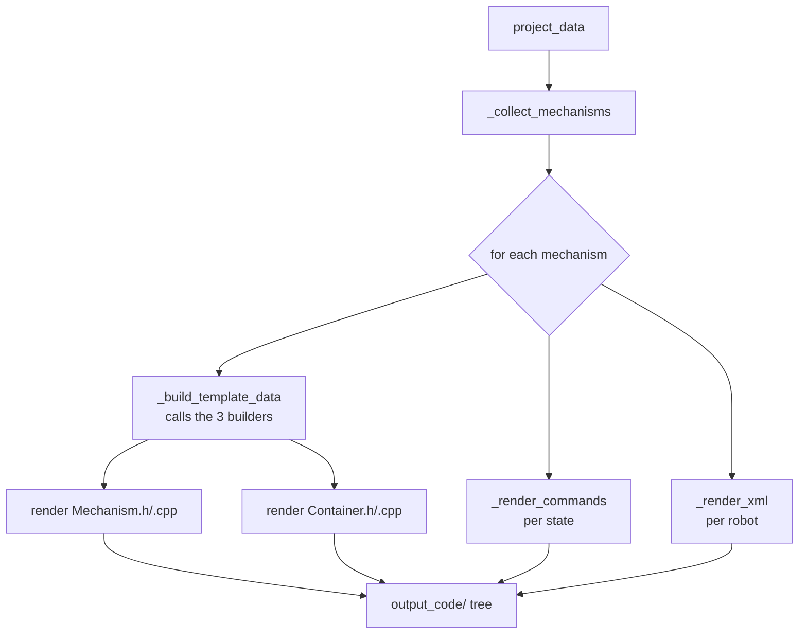

# Dragon Code Generator V2 — Architecture & Contributor Guide

This document explains **how the whole tool works end to end** so that a new
developer can confidently extend it. If you only need the template/Jinja2
details, see [TEMPLATE_GUIDE.md](TEMPLATE_GUIDE.md).

---

## 1. The 10,000-foot view

The tool has two halves that meet at one shared data structure — the **project
dictionary** (`project_data`).

```
┌─────────────┐     project_data      ┌──────────────┐   Jinja2    ┌───────────┐
│   gui/      │ ───────(a dict)─────► │  generation/ │ ──renders─► │ C++ + XML │
│  (PyQt6)    │  saved/loaded as JSON │  (generator) │  templates  │  output   │
└─────────────┘                       └──────────────┘             └───────────┘
```

- **`gui/`** builds and edits `project_data` through a desktop UI and
  saves/loads it as JSON.
- **`generation/`** reads `project_data`, reshapes it into template-ready
  payloads, and renders the `templates/` into `output_code/`.
- The two halves are **decoupled**: the generator never imports Qt, and the GUI
  only calls `DragonCodeGenerator.generate(project_data)`. You can drive the
  generator from a script with a hand-written / loaded JSON and never open the
  GUI.

> **Suite shell:** the whole app is wrapped in a tabbed **Dragon Tool Suite**
> window (`gui/suite.py`) so it can host many tools over time. The Mechanism
> Generator described here is the first tab; the second tab (**Auton Builder**) is
> currently a blank placeholder. See [§3.0](#30-the-suite-shell-guisuitepy).

---

## 2. The project data model

Everything the tool knows about lives in one nested dictionary. Understanding its
shape is the single most important thing for working on this codebase.

```python
project_data = {
    "project_name": "New_FRC_Project",
    "robots": {
        "COMP_BOT_302": {                       # robot id (key)
            "name": "Comp Bot",
            "team_number": 302,
            "mechanisms": {
                "Intake": {                     # mechanism name (key)
                    "hardware": [ ... ],        # list of hardware dicts
                    "control_data": [ ... ],    # list of control-data dicts
                    "states": [ ... ],          # list of state dicts
                },
            },
        },
    },
}
```

### Hardware dict

```python
{
    "type": "TalonFX",          # TalonFX | TalonFXS | CANCoder | CANdi | Solenoid | DigitalInput
    "name": "intake",           # logical device name
    "id": 0,                    # CAN id
    "bus": "canivore",
    "config": { ... },          # CTRE config blocks (CurrentLimits, MotorOutput, Feedback, ...)
}
```

The default `config` for each type is produced by
[`gui/hardware_defaults.py`](../gui/hardware_defaults.py).

### Control-data dict

A named bundle of a control request + PID/feedforward gains + a unit:

```python
{
    "name": "IntakePercentOut",
    "ControlRequest": "DutyCycleOut",   # or PositionVoltage, MotionMagicVoltage, ...
    "Unit": "double",                   # double | turn | inch | deg | RPM | volt
    "p": 0.0, "i": 0.0, "d": 0.0, "f": 0.0,
    "velocity_gain": 0.0, "acceleration_gain": 0.0, "static_friction_gain": 0.0,
    "max_acceleration": 0.0, "cruise_velocity": 0.0,
    "GravityTypeValue": "Elevator_Static",
    "StaticFeedforwardSignValue": "UseVelocitySign",
}
```

### State dict

One state of a mechanism. Each state names a target per motor and a boolean per
solenoid:

```python
{
    "name": "Intake",
    "motor_targets": [
        {"HardwareName": "intake", "Enabled": True, "TargetValue": 1.0,
         "ControlData": "IntakePercentOut", "Unit": "double"},
    ],
    "solenoid_targets": [
        {"SolenoidName": "clamp", "Enabled": True, "State": True},
    ],
}
```

> **Key relationship:** a `motor_target` links a **motor** (`HardwareName`) to a
> **control-data block** (`ControlData`) and gives it a `TargetValue`. That link
> is what drives almost everything the generator computes — the control request,
> the setter method, the Slot0 gains, and the logging.

---

## 3. The GUI layer (`gui/`)

The GUI is a thin, Qt-heavy shell around a Qt-free data model. This split keeps
all business logic testable and independent of the widgets.

### 3.0 The suite shell (`gui/suite.py`)

`DragonSuiteWindow` is the application's top-level `QMainWindow`. Its central
widget is a `QTabWidget`, and each tool is added as one tab:

```python
self.tabs.addTab(self.mechanism_generator, "Mechanism Generator")
self.tabs.addTab(self.auton_builder, "Auton Builder")  # blank placeholder
```

Each tool is a self-contained widget, so the suite can grow without any one tool
knowing about the others. The Mechanism Generator is itself a `QMainWindow`
(`MechanismEditorWindow`), so embedding it as a tab preserves its own menu bar,
status bar, and behavior. **To add a new tool:** build its widget (ideally in its
own module/package) and call `self.tabs.addTab(widget, "Tool Name")` in
`DragonSuiteWindow.__init__`. `main.py` launches `DragonSuiteWindow`.

### 3.1 Mechanism Generator widgets

| File                                                   | Responsibility                                                                 |
| ------------------------------------------------------ | ------------------------------------------------------------------------------ |
| [`gui/suite.py`](../gui/suite.py)                      | `DragonSuiteWindow` — the tabbed suite shell that hosts every tool.            |
| [`gui/mechanism_builder.py`](../gui/mechanism_builder.py)                    | All PyQt6 widgets: the tree, the contextual editor, dialogs, menu, and the **Generate** button. Reads/writes `project_data` **only** through `ProjectModel`. |
| [`gui/model.py`](../gui/model.py)                       | `ProjectModel` — the Qt-free data layer. Owns `project_data`, file I/O, and every mutation/query (add/delete robot, mechanism, hardware, state, target syncing). |
| [`gui/constants.py`](../gui/constants.py)               | Pure data: `VERSION`, `DEFAULT_PROJECT`, unit options, and `ENUM_FIELDS` (the allowed values for every CTRE enum dropdown). |
| [`gui/hardware_defaults.py`](../gui/hardware_defaults.py) | Factory functions returning fresh default dicts for hardware, control data, and state targets. |

### How the editor renders

`mechanism_builder.py` stores a small "node descriptor" dict on every tree item (via
`item.setData(0, 256, {...})`). When you click a node, `render_editor()` reads
that descriptor and builds the right property panel:

- `folder_*` nodes show an **Add New** section plus every existing child.
- `item_hardware` / `item_cd` show a generic dictionary editor driven by the
  dict's keys, using `ENUM_FIELDS` to turn known fields into dropdowns.
- `item_state` shows the per-motor / per-solenoid target editor.

### Keeping states in sync with hardware

When hardware is added or removed, states must gain or lose the matching target.
That reconciliation lives in `ProjectModel.sync_state_targets()` (and the
add/delete paths in `model.py`). It matches targets to hardware **by name**,
preserves existing values, drops orphaned targets, and mirrors each target's
`Unit` from its selected control data. If you touch hardware/state mutation, keep
this invariant intact: **every motor/solenoid on a mechanism has exactly one
target per state.**

### Generation trigger

The **Generate C++ Code** button calls `MechanismEditorWindow.trigger_generation()`,
which simply does:

```python
generator = DragonCodeGenerator(version=VERSION)
generator.generate(self.project_data)
```

---

## 4. The generation layer (`generation/`)

The generator is an **orchestrator + focused builders + pure helpers** design.
Each builder owns one slice of the C++ payload so the logic stays small and
independently testable.

| Module                                                   | Class / role                | Produces                                                                 |
| -------------------------------------------------------- | --------------------------- | ------------------------------------------------------------------------ |
| [`generation/generator.py`](../generation/generator.py)   | `DragonCodeGenerator`       | The orchestrator. Collects mechanisms across robots, assembles the template payload, renders every template, writes files. |
| [`generation/hardware.py`](../generation/hardware.py)     | `HardwareBuilder`           | Per-robot/per-hardware `Initialize*` method bodies (CTRE config apply), include flags, solenoid plumbing. |
| [`generation/control_data.py`](../generation/control_data.py) | `ControlDataBuilder`    | Control requests, active targets, `UpdateTarget*` setters, closed-loop Slot0 mapping, per-loop `SetControl` updates. |
| [`generation/states.py`](../generation/states.py)         | `StateBuilder`              | Per-command unit `#include`s and per-motor logging (`DataLog`/`RefreshCachedData`). |
| [`generation/naming.py`](../generation/naming.py)         | pure functions              | All naming/formatting/unit mapping. Registered as Jinja2 filters and reused by every builder. |

### The generate() pipeline

`DragonCodeGenerator.generate(project_data)` runs these steps:

1. **`_collect_mechanisms`** — walk every robot and build a *global* per-mechanism
   view (`states`, `state_details`, `hardware`, `control_data`). The same
   mechanism on multiple robots is merged. Hardware is keyed by `(name, type)`
   because one logical device (e.g. `extender`) may map to several hardware
   objects (a TalonFXS + a CANdi).
2. For each mechanism:
   - **`_build_template_data`** — call the builders to compute the full payload
     shared by the `Mechanism.h/.cpp` templates.
   - Render `Mechanism.h/.cpp` and `Container.h/.cpp`.
   - **`_render_commands`** — for each state, build `cmd_data` and render
     `Command.h/.cpp`.
   - **`_render_xml`** — for each robot that owns the mechanism, render its
     control-data XML into `src/main/deploy/<team>/mechanisms/`.



### The naming helpers (Jinja2 filters)

`naming.py` is deliberately state-free — pure string/unit transforms shared by
the builders and exposed to templates as filters (registered in
`DragonCodeGenerator.__init__`):

| Filter          | Function                | Example                                            |
| --------------- | ----------------------- | -------------------------------------------------- |
| `state_enum`    | `state_enum`            | `"Empty Hopper"` → `"STATE_EMPTY_HOPPER"`          |
| `state_class`   | `state_class`           | `"Empty Hopper"` → `"EmptyHopper"`                 |
| `member_var`    | `member_variable`       | `{name:"intake", type:"TalonFX"}` → `"m_intakeMotor"` |
| `target_method` | `generate_target_method`| motor target → `"UpdateTargetIntakePercentOut"`    |
| `unit`          | `get_unit`              | `"deg"` → `"wpi::units::angle::degree_t"`          |
| `short_unit`    | `get_short_unit`        | `"deg"` → `"_deg"`                                  |
| `camel`         | `camel_case`            | `"intake_roller"` → `"intakeRoller"`               |
| `upper_camel`   | `upper_camel_case`      | `"intake_roller"` → `"IntakeRoller"`               |
| `cpp_type`      | `cpp_type`              | `"Solenoid"` → `"frc::Solenoid"`                   |

These accept any common name style (`spaced`, `snake_case`, `camelCase`, or an
already-prefixed `STATE_...`) and normalize it, so the GUI doesn't have to
enforce one exact spelling.

---

## 5. The templates (`templates/`)

Plain-text Jinja2 files with "holes" the generator fills. One template renders
per output file type.

| Template                                                     | Renders to                              |
| ------------------------------------------------------------ | --------------------------------------- |
| [`Mechanism.h.jinja`](../templates/Mechanism.h.jinja)         | `<Mech>.h` — subsystem header (enum, members, per-robot Create/Initialize, setters). |
| [`Mechanism.cpp.jinja`](../templates/Mechanism.cpp.jinja)     | `<Mech>.cpp` — subsystem implementation (hardware init, Update loop, logging). |
| [`Container.h.jinja`](../templates/Container.h.jinja)         | `<Mech>Container.h`.                    |
| [`Container.cpp.jinja`](../templates/Container.cpp.jinja)     | `<Mech>Container.cpp`.                  |
| [`Command.h.jinja`](../templates/Command.h.jinja)             | `<Mech><State>Command.h` — one per state. |
| [`Command.cpp.jinja`](../templates/Command.cpp.jinja)         | `<Mech><State>Command.cpp` — one per state. |
| [`Mechanism.xml.jinja`](../templates/Mechanism.xml.jinja)     | `<Mech>.xml` — per-team control-data deploy file. |

The payload dict passed to `template.render(...)` is what the template can see:
every top-level key becomes a variable. See
[TEMPLATE_GUIDE.md](TEMPLATE_GUIDE.md) for the exact keys and Jinja2 syntax.

---

## 6. How to extend the tool (recipes)

### Add a new hardware type

1. **Defaults** — add a factory branch in
   [`gui/hardware_defaults.py`](../gui/hardware_defaults.py) `default_hardware()`
   returning the default `config` for the type.
2. **GUI button** — add a `+ <Type>` button in `render_add_hardware_menu()` in
   [`gui/mechanism_builder.py`](../gui/mechanism_builder.py), wired to `self.add_hardware(mech_data, "<Type>")`.
3. **Naming** — add the type to `MEMBER_TYPE_SUFFIX` (and `HARDWARE_CPP_TYPE` if
   it's a WPILib/`frc::` type, or leave it to default to `ctre::phoenix6::hardware::<Type>`)
   in [`generation/naming.py`](../generation/naming.py).
4. **Init body** — if the type needs CTRE configuration, add a
   `_build_<type>_init_body` in [`generation/hardware.py`](../generation/hardware.py)
   and dispatch to it from `hardware_init_methods()`. Motors/CANdi already have
   builders; Solenoid/DigitalInput are skipped (they only need construction).
5. **Templates** — reference the new member/include where needed (guard optional
   includes behind a `has_*` flag from `HardwareBuilder.hardware_flags`).

### Add a new CTRE config block to an existing motor

1. Add the block's default keys to the motor `config` in
   [`gui/hardware_defaults.py`](../gui/hardware_defaults.py).
2. If any field is an enum, add its allowed values to `ENUM_FIELDS` in
   [`gui/constants.py`](../gui/constants.py) so the editor renders a dropdown.
3. In `_build_motor_init_body` in [`generation/hardware.py`](../generation/hardware.py),
   add an `emit(block, [...])` mapping each JSON key to its `configs.<Path>` and
   the right formatter (`amp`, `sec`, `volt`, `turn`, `boolean`, `raw`, or
   `nm.sig_enum(...)` for signal enums). Only present keys are emitted.

### Add a new unit

Add the unit consistently to `UNIT_PREFIXES`, `UNIT_INCLUDES`, and
`SHORT_UNIT_SUFFIX` in [`generation/naming.py`](../generation/naming.py), and to
`UNIT_OPTIONS` in [`gui/constants.py`](../gui/constants.py).

### Add a new generator filter

Write a pure function in [`generation/naming.py`](../generation/naming.py) and
register it in `DragonCodeGenerator.__init__` with
`self.env.filters["<name>"] = nm.<function>`. Then use `{{ value | <name> }}` in
any template.

### Change the generated file layout

The output paths are assembled in `generate()`, `_render_commands()`, and
`_render_xml()` in [`generation/generator.py`](../generation/generator.py). Keep
the WPILib-relative structure (`src/main/cpp/...`, `src/main/deploy/...`) so the
output still drops into a robot project.

---

## 7. Testing a change without the GUI

Because the generator is Qt-free, you can render from a JSON project directly:

```python
import json
from generation import DragonCodeGenerator

with open("MyProject.json") as f:
    project_data = json.load(f)

DragonCodeGenerator(version="2026.1.0").generate(project_data)
# inspect output_code/
```

This is the fastest way to iterate on builders and templates.

---

## 8. Conventions & gotchas

- **Never put Qt in `generation/`** and never put generation logic in `gui/`.
  The `ProjectModel` boundary is what keeps both halves testable.
- **Hardware is keyed by `(name, type)`**, not just name — one logical device can
  be several hardware objects.
- **Every state must have one target per motor/solenoid.** Preserve this when
  editing mutation code (`sync_state_targets`).
- **Only present config keys are emitted.** The `emit()` helpers skip missing
  keys, so partial configs are safe.
- **Open-loop motors get no Slot0.** Slot0 gains are only emitted for motors with
  a closed-loop (Position/Velocity/MotionMagic) control request.
- **`output_code/` and `tool_settings.json` are git-ignored** — don't commit
  generated output.
